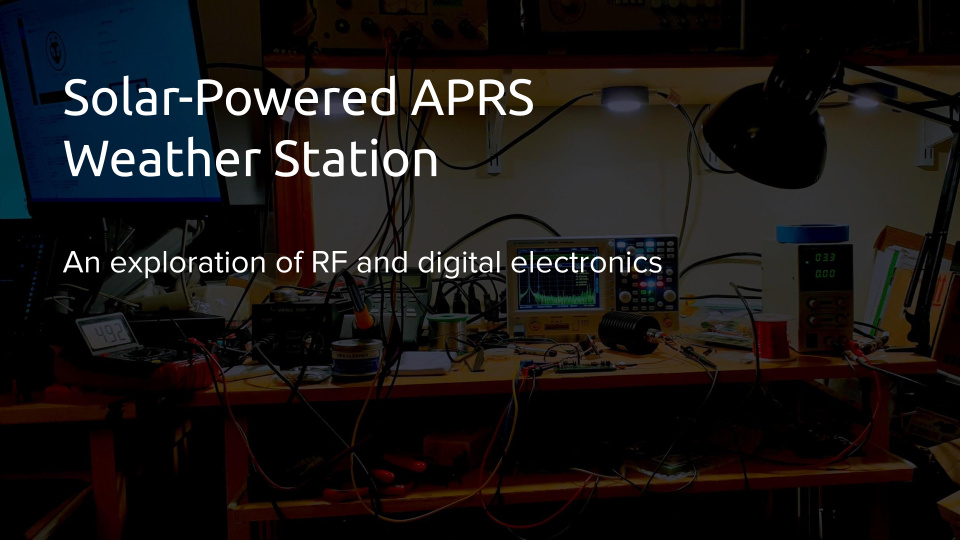

# aprs-weather-station
An APRS weather station with a transmitter designed from scratch

_(Slideshow with more info)_

For more information, see my [blog](https://www.hosticlefifer.com/blog/?show=14)!

